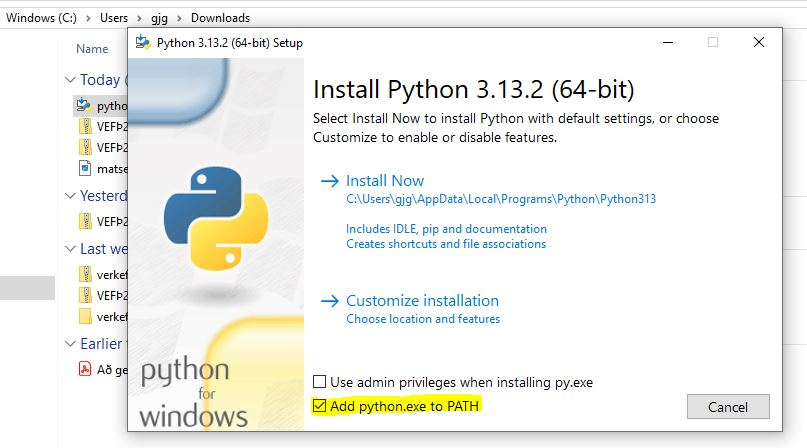
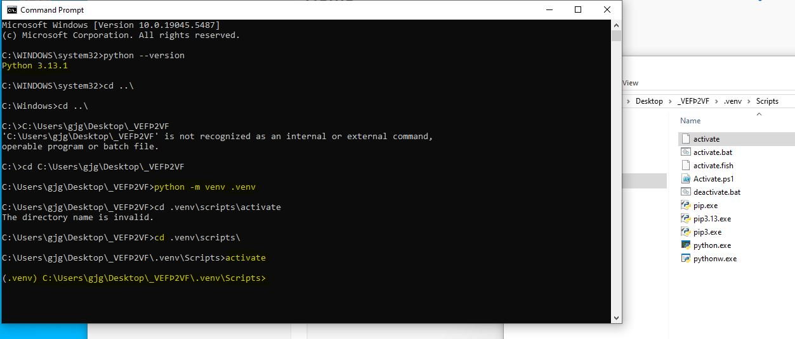
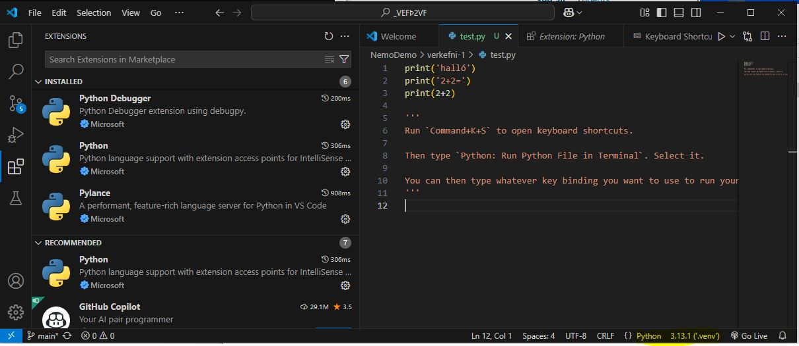
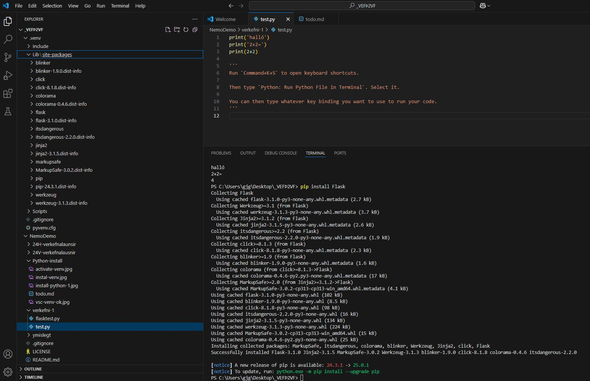
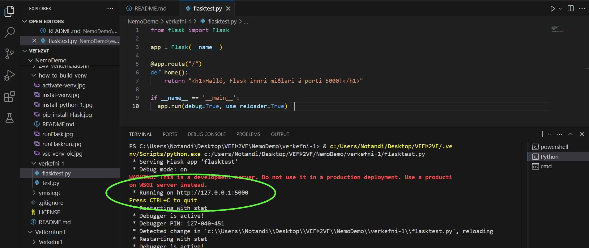
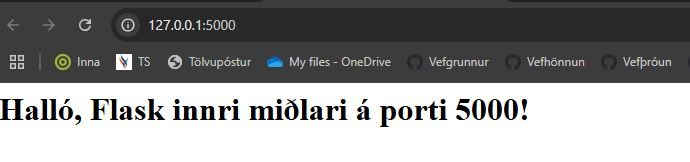

# How to build a Virtual Environment

1. install Python -> hakið við `PATH`
   * 

## How to Install Flask on Linux, Windows, and macOS

- Step 1: Install Virtual Environment. 
  * PC: `python -m venv .venv` 
  * Mac/Linux: `python3 -m venv .venv`
- Step 2: Create an Environment. `cd .venv\Scripts\`
- Step 3: Activate the Environment. `activate`
  * 
- Step 4: Í Visual Studio Code - bætið Python í Extension
  * Neðst í hægra horni forritsins á að sjást `Python 3.13.1 (.venv)`
  * 
- Step 5: In VSC, Python teminal, install Flask. `pip install Flask`
  * 

### Test the Development Environment

- Step 6: Setjið eftirfarandi kóða í py skjal

```python

from flask import Flask

app = Flask(__name__)

@app.route("/")
def home():
    return "<h1>Halló, Flask innri miðlari á porti 5000!</h1>"

if __name__ == '__main__':
  app.run(debug=True, use_reloader=True)  

```
- Step 7: Keyrið python skjalið (_run python file_)
- Step 8: Hægri smellið á 'http://127.0.0.1:5000' í _terminal_ og opnið vafra
  - 
  - 